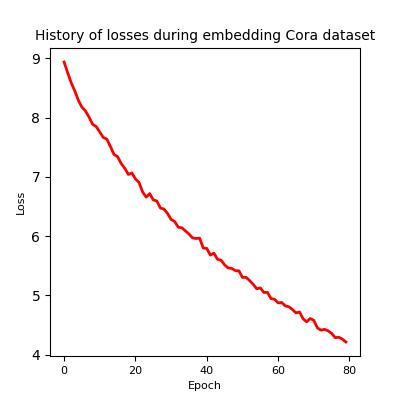

# Deepwalk - Clone
Clone implementation of [deepwalk paper](https://arxiv.org/abs/1403.6652) in PyTorch.
- [Source code by the original author](https://github.com/phanein/deepwalk)


## Install
#### Requirements:
- python >= 3.9
#### Commmand:
```bash
pip install git+https://github.com/helloybz/deepwalk-clone.git
```
## Usage
```bash
deepwalk --data_root PATH --output_root PATH --config_file PATH [--gpu] [--checkpoint_period=0 INT]
```
--data_root is supposed to be a directory which contains at least 2 files, `V` and `E`.\
`V` contains list of node ids separated by `\n`.\
`E` contains list of pairs of node id, separated by `\n`.\
The pair of node should has a form like `[source_node_id]\t[target_node_id`.
### Example
`data_root/V`
```txt
1
2
3
4
5
```
`data_root/E`
```txt
1\t2
1\t4
2\t5
3\t1
```
## Config file
All of the hyper-parameters of deepwalk is controlled in this `yaml` file.\
Below is an example of the config file.
```yaml
n_dims: 128 # referred as d in the paper.
random_walker:
  steps_per_walk: 40 # referred as t in the paper.
  walks_per_node: 80 # referred as r in the paper.
skipgram:
  lr: 0.025
  window_size: 10 # referred as w in the paper.
```

## Experiments

 CORA dataset, a citation network, is used.\
 Identical hyper parameters introduced in the paper are used to
 both the original Deepwalk and the cloned Deepwalk.\
 - 128 dimensions
 - 40 steps per walk
 - 80 walks per node
 - 10 window size (10+10+1 for both directions.)
### Loss graph

### Multi-Label Classification
 - Logistic regression is used as classifier.
 - Train:Test ratio varies from 1:9 to 9:1.
 - Metrics are averaged after 10 runs.
 - There are 7 classes in CORA dataset.
#### Micro F1
Column name means the percentage of train split.
| Method         | 10%       | 20%       | 30%       | 40%       | 50%       | 60%       | 70%       | 80%       | 90%       |
| -------------- | --------- | --------- | --------- | --------- | --------- | --------- | --------- | --------- | --------- |
| Deepwalk-Clone | **0.219** | **0.242** | **0.282** | **0.335** | **0.347** | **0.342** | **0.360** | **0.377** | **0.352** |
| Deepwalk       | 0.200     | 0.206     | 0.215     | 0.223     | 0.213     | 0.236     | 0.242     | 0.256     | 0.247     |


#### Macro F1
Column name means the percentage of train split.
| Method         | 10%       | 20%       | 30%       | 40%       | 50%       | 60%       | 70%       | 80%       | 90%       |
| -------------- | --------- | --------- | --------- | --------- | --------- | --------- | --------- | --------- | --------- |
| Deepwalk-Clone | **0.411** | **0.421** | **0.427** | **0.457** | **0.478** | **0.468** | **0.477** | **0.511** | **0.454** |
| Deepwalk       | 0.135     | 0.138     | 0.144     | 0.132     | 0.122     | 0.136     | 0.128     | 0.125     | 0.108     |